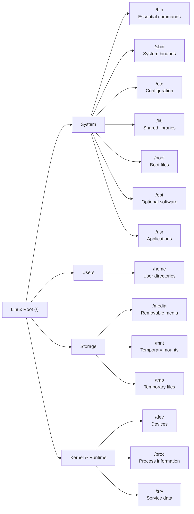
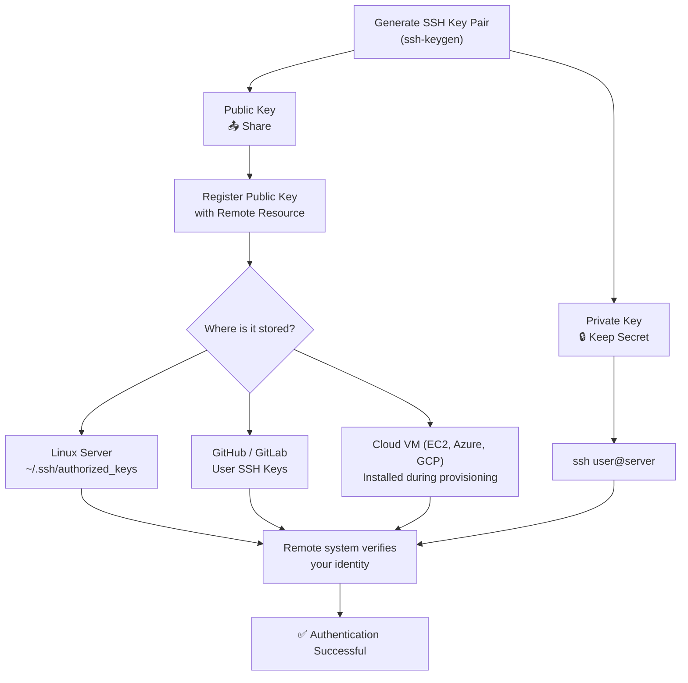

# Linux Toolbox (Week 2)

A quick-reference guide for common Linux concepts and commands.

---
<details>
<summary><strong>Day 1 – Filesystem & Navigation</strong></summary>

<details>
<summary><strong>Linux File Hierarchy</strong></summary>



---

## Common Directories

| Directory | Purpose |
|-----------|---------|
| `/` | Root of the Linux filesystem |
| `/bin` | Essential user commands |
| `/boot` | Boot loader files |
| `/dev` | Device files |
| `/etc` | System configuration |
| `/home` | User home directories |
| `/lib` | Shared libraries |
| `/media` | Removable media |
| `/mnt` | Temporary mount points |
| `/opt` | Optional software |
| `/proc` | Process and kernel information |
| `/sbin` | System administration commands |
| `/srv` | Service data |
| `/tmp` | Temporary files |
| `/usr` | User applications and utilities |

---

</details>

---

<details>
<summary><strong>Absolute vs Relative Paths</strong></summary>

## Absolute Path

**Definition**

Starts at the root directory (`/`) and always points to the same location.

**Example**

```bash
cat /home/user/projects/linux/notes.txt
```

**Use When**

- Shell scripts
- Cron jobs
- System configuration
- Accuracy is critical

---

## Relative Path

**Definition**

Starts from the current working directory.

**Example**

Current directory:

```bash
/home/user
```

Command:

```bash
cd projects/linux
```

Moves to:

```bash
/home/user/projects/linux
```

---

## Special Path Symbols

| Symbol | Meaning |
|--------|---------|
| `.` | Current directory |
| `..` | Parent directory |
| `~` | Current user's home directory |

**Examples**

```bash
./script.sh
```

```bash
cd ../../backup
```

```bash
cd ~
```

```bash
~/platform_practice
```

---

## When to Use

### Absolute Paths

✅ Best for:

- Shell scripts
- Cron jobs
- System services
- Configuration files

### Relative Paths

✅ Best for:

- Interactive terminal use
- Project navigation
- Quick file operations

---

## Common Mistakes

- Forgetting your current working directory
- Using relative paths inside automation scripts
- Mixing Windows (`\`) and Linux (`/`) path separators
- Forgetting that `~` only represents the current user's home directory

---

## Quick Tips

- Use `pwd` to display your current directory.
- Use `~` instead of typing your full home directory.
- Prefer absolute paths in automation.
- Prefer relative paths while navigating projects.

---

</details>

---

<details>
<summary><strong>Linux Tips & Shortcuts</strong></summary>

<details>
<summary><strong>Getting Help</strong></summary>

### Manual Pages

Displays the complete documentation for a command.

```bash
man <command>
```

Example:

```bash
man find
```

---

### Quick Help

Displays the available options for a command.

```bash
<command> --help
```

Example:

```bash
find --help
```

---

### TLDR

Provides short, practical examples for common commands.

```bash
tldr <command>
```

Example:

```bash
tldr find
```

Install:

```bash
sudo apt install tldr
```

---

</details>

<details>
<summary><strong>Wildcards</strong></summary>

| Wildcard | Meaning |
|----------|---------|
| `*` | Matches everything |
| `?` | Matches a single character |
| `*.log` | Every `.log` file |
| `*.txt` | Every `.txt` file |

Example:

```bash
mv *.log archive/
```

---
</details>

<details>
<summary><strong>Brace Expansion</strong></summary>

Create multiple directories:

```bash
mkdir -p project/{configs,scripts,logs,data,archive}
```

Create multiple files:

```bash
touch {app,upload,error,debug}.log
```

Numbered files:

```bash
touch server{1..5}.log
```

Works with:

- mkdir
- touch
- cp
- mv
- rm

---
</details>

<details>
<summary><strong>Directory Shortcuts</strong></summary>

| Symbol | Meaning |
|---------|---------|
| `.` | Current directory |
| `..` | Parent directory |
| `~` | Home directory |

Examples:

```bash
cd ..
```

```bash
cd ~
```

```bash
./script.sh
```

---
</details>

<details>
<summary><strong>Copying Files</strong></summary>

Copy a file:

```bash
cp file.txt backup/
```

Copy a directory:

```bash
cp -r project backup/
```

Copy a directory while preserving permissions and timestamps:

```bash
cp -a project backup/
```

Copy only the contents of a directory:

```bash
cp -a source/. destination/
```

---
</details>

<details>
<summary><strong>Moving Files</strong></summary>

Move one file:

```bash
mv file.txt archive/
```

Move multiple files:

```bash
mv *.log archive/
```

Rename a file:

```bash
mv old.txt new.txt
```

---
</details>

<details>
<summary><strong>Creating Files</strong></summary>

Create an empty file:

```bash
touch notes.txt
```

Create multiple files:

```bash
touch {dev,test,prod}.yaml
```

---
</details>

<details>
<summary><strong>Finding Files</strong></summary>

Find every log file:

```bash
find . -name "*.log"
```

Find directories only:

```bash
find . -type d
```

Find files only:

```bash
find . -type f
```

Search from the current directory:

```bash
find .
```

---
</details>

<details>
<summary><strong>Disk Usage</strong></summary>

Show directory sizes:

```bash
du -sh *
```

Largest first:

```bash
du -sh * | sort -hr
```

Smallest first:

```bash
du -sh * | sort -h
```

Check filesystem usage:

```bash
df -h
```

Remember:

- **df** = Disk Free (filesystem usage)
- **du** = Disk Usage (directory/file usage)

---
</details>

<details>
<summary><strong>Verify Your Work</strong></summary>

Common verification commands:

```bash
pwd
```

Current directory.

```bash
ls
```

List files.

```bash
ls -l
```

Detailed listing.

```bash
tree
```

Display directory structure.

---
</details>

<details>
<summary><strong>Common Mistakes</strong></summary>

### `*` expands before the command runs.

Example:

```bash
cp -r * backup/
```

If `backup` is inside the current directory, you'll try to copy `backup` into itself.

---

Use quotes when variables or filenames may contain spaces.

```bash
cp "$file" backup/
```

---

Prefer absolute paths in scripts.

Prefer relative paths while navigating manually.

---

Always verify your results after moving or copying files.

Useful commands:

```bash
tree
ls
pwd
```

---
</details>

# My Workflow

When I don't know a command:

1. Try it.
2. Read `--help`.
3. Check `tldr`.
4. Read the `man` page if needed.
5. Add anything useful to this toolbox.

</details>
</details>

---

<details>
<summary><strong>Day 2: Linux Permissions</strong></summary>

<details>
<summary><strong>File Permissions</strong></summary>

## Permission Types

| Permission | Symbol | Value | Meaning |
|------------|--------|------:|---------|
| Read | `r` | 4 | View file contents or list directory contents |
| Write | `w` | 2 | Modify a file or create/delete files in a directory |
| Execute | `x` | 1 | Execute a file or traverse a directory |

Permissions are assigned to three categories:

| Category | Meaning |
|----------|---------|
| User (u) | File owner |
| Group (g) | Users belonging to the file's group |
| Others (o) | Everyone else |

---

## Reading Permissions

Example:

```text
-rwxr-x---
```

Break it into groups of three:

```text
- rwx r-x ---
  │   │   │
  │   │   └── Others
  │   └────── Group
  └────────── Owner
```

| Category | Permissions |
|----------|-------------|
| Owner | Read, Write, Execute |
| Group | Read, Execute |
| Others | No permissions |

---

## Octal Permissions

| Number | Binary | Permission |
|--------:|--------|------------|
| 0 | --- | No permissions |
| 1 | --x | Execute |
| 2 | -w- | Write |
| 3 | -wx | Write + Execute |
| 4 | r-- | Read |
| 5 | r-x | Read + Execute |
| 6 | rw- | Read + Write |
| 7 | rwx | Read + Write + Execute |

Examples:

| Permission | Octal |
|------------|:-----:|
| `rw-------` | `600` |
| `rwx------` | `700` |
| `rw-r--r--` | `644` |
| `rwxr-xr-x` | `755` |
| `rwxrwx---` | `770` |

---

## Common Permission Sets

### `600`

```text
-rw-------
```

- Configuration files
- API keys
- SSH private keys
- Secrets

---

### `644`

```text
-rw-r--r--
```

- Source code
- Documentation
- Public configuration

---

### `700`

```text
-rwx------
```

- Personal scripts
- Private directories

---

### `755`

```text
-rwxr-xr-x
```

- Executable programs
- Shell scripts
- Utilities

---

### `770`

```text
drwxrwx---
```

- Shared engineering directories
- Team project folders

</details>

---

<details>
<summary><strong>chmod</strong></summary>

Change file or directory permissions.

## Syntax

```bash
chmod [permissions] file
```

### Numeric Mode

Replaces the existing permissions.

```bash
chmod 600 config/app.conf
chmod 644 config.yml
chmod 700 deploy.sh
chmod 755 install.sh
chmod 770 shared
```

### Symbolic Mode

Adds or removes specific permissions.

```bash
chmod +x deploy.sh
chmod u+x deploy.sh
chmod g+w shared
chmod o-r secret.txt
chmod a+r file.txt
```

---

## Directories vs Files

### Files

Execute permission means:

> Run the file as a program.

```bash
./deploy.sh
```

### Directories

Execute permission means:

> Traverse (enter) the directory.

Without execute permission you cannot:

- `cd` into the directory
- Access files inside it

Even if you have read permission.

</details>

---

<details>
<summary><strong>Ownership & Groups</strong></summary>

### chown

Change file ownership.

```bash
sudo chown owner file
```

Examples:

```bash
sudo chown root app.log
sudo chown mlogan app.log
sudo chown mlogan:docker shared
```

Changing ownership generally requires `sudo`.

---

### chgrp

Change a file or directory group.

```bash
sudo chgrp docker shared
```

Verify:

```bash
ls -ld shared
```

---

### groups

Display the groups the current user belongs to.

```bash
groups
```

Example:

```text
mlogan adm sudo docker
```

---

### ls -ld

Display information about the directory itself.

```bash
ls -ld shared
```

Without `-d`:

```bash
ls -l shared
```

lists the directory contents instead.

</details>

---

<details>
<summary><strong>find -exec</strong></summary>

Run a command on every result returned by `find`.

## Syntax

```bash
find <path> <filters> -exec <command> {} \;
```

- `{}` → Current search result
- `\;` → End of the command

### Examples

```bash
find . -name "*.sh" -exec chmod 755 {} \;
```

```bash
find . -name "*.tmp" -exec rm {} \;
```

```bash
find . -name "*.log" -exec grep "ERROR" {} \;
```

### Common Platform Engineering Pattern

```bash
find sequencing_data -type d -exec chmod 770 {} \;
find sequencing_data -type f -exec chmod 660 {} \;
```

This allows different permissions to be applied to directories and files.

</details>

---

<details>
<summary><strong>Best Practices & Troubleshooting</strong></summary>

## Principle of Least Privilege

Only grant the permissions required.

✅ Correct:

```bash
chmod 600 app.conf
```

❌ Unnecessary:

```bash
chmod 700 app.conf
```

Configuration files are data, not executable programs.

---

## Troubleshooting Checklist

Check permissions:

```bash
ls -l file
```

Check directory permissions:

```bash
ls -ld directory
```

Check owner and group:

```bash
ls -l
```

Check current user:

```bash
whoami
```

Check current user's groups:

```bash
groups
```

</details>

</details>

---

<details>
<summary><strong>Day 3: SSH, Users & Groups</strong></summary>

<details>
<summary><strong>SSH</strong></summary>

## Purpose

SSH provides secure remote access and passwordless authentication using public-key cryptography.

Common uses:

- Linux servers
- GitHub/GitLab
- Cloud VMs
- CI/CD
- Automation

Steps: 


---

<details>
<summary><strong>SSH Keys</strong></summary>

## Generate a Key

```bash
ssh-keygen -t ed25519 -C "comment"
```

### Common Options

| Option | Purpose |
|---------|----------|
| `-t` | Key type |
| `-C` | Comment |
| `-f` | Output filename |

Example:

```bash
ssh-keygen -t ed25519 -C "comment" \
-f ~/.ssh/platform_bootcamp_ed25519
```

---

### Key Types

| Key Type  | Cryptography           | Status                                               |
| --------- | ---------------------- | ---------------------------------------------------- |
| `ed25519` | Elliptic Curve (EdDSA) | ✅ Recommended                                        |
| `rsa`     | RSA                    | ✅ Still widely supported                             |
| `ecdsa`   | Elliptic Curve (ECDSA) | Supported, but generally less preferred than Ed25519 |
| `dsa`     | DSA                    | ❌ Deprecated                                         |


---

### SSH Directory

```text
~/.ssh/
```

| File | Purpose |
|------|---------|
| `id_ed25519` | Private key |
| `id_ed25519.pub` | Public key |
| `authorized_keys` | Trusted public keys |
| `known_hosts` | Known server fingerprints |

---

### Common Commands

```bash
ls -la ~/.ssh
cat ~/.ssh/id_ed25519.pub
ls -l ~/.ssh/id_ed25519*
```

---

### Public Key Format

```text
ssh-ed25519 <base64-key> <comment>
```

Components:

1. Algorithm
2. Public key
3. Comment

---

### Security

✅ Share

- Public key

❌ Never share

- Private key
- Passphrase

</details>

---

<details>
<summary><strong>Passwordless Authentication</strong></summary>

Authentication flow:

```text
Your Computer                      Remote Server

Private Key
      │
      ▼
Signs challenge
      │
      ├──────────── SSH ───────────►
                                     authorized_keys
                                     contains matching
                                     public key

                                     Login succeeds
```

The private key never leaves your computer.

</details>

---

<details>
<summary><strong>authorized_keys</strong></summary>

Purpose:

Stores every public key authorized to log into a Linux account.

Location:

```text
~/.ssh/authorized_keys
```

---

### Add a Public Key

```bash
cat ~/.ssh/id_ed25519.pub >> ~/.ssh/authorized_keys
```

Always use:

```text
>>
```

Never:

```text
>
```

---

### Backup

```bash
cp ~/.ssh/authorized_keys ~/.ssh/authorized_keys.backup
```

---

### View

```bash
cat ~/.ssh/authorized_keys
cat -n ~/.ssh/authorized_keys
tail ~/.ssh/authorized_keys
```

</details>

---

<details>
<summary><strong>Permissions</strong></summary>

| Path | Permission |
|------|-----------:|
| `~/.ssh` | `700` |
| `authorized_keys` | `600` |
| Private key | `600` |
| Public key | `644` |

SSH may reject authentication if permissions are too permissive.

</details>

---

<details>
<summary><strong>Deployment Methods</strong></summary>

### Manual

```bash
cat id_ed25519.pub >> ~/.ssh/authorized_keys
```

### Preferred

```bash
ssh-copy-id user@server
```

Automatically:

- Creates `.ssh`
- Copies public key
- Updates `authorized_keys`
- Sets permissions

### Cloud

- AWS EC2
- Azure VM
- Google Compute Engine

### Automation

- Ansible
- Puppet
- Chef

</details>

---

<details>
<summary><strong>Troubleshooting</strong></summary>

### View Public Key

```bash
cat ~/.ssh/id_ed25519.pub
```

### Verify Permissions

```bash
ls -la ~/.ssh
```

### Remove Last Line

```bash
sed -i '$d' ~/.ssh/authorized_keys
```

### Common Error

`Saving key "~/.ssh/..." failed`

Cause:

`~` is expanded by the shell, **not** by `ssh-keygen`'s interactive prompt.

Use:

```text
/home/user/.ssh/key_name
```

or

```bash
ssh-keygen -f ~/.ssh/key_name
```

</details>

---

<details>
<summary><strong>Platform Engineering Examples</strong></summary>

- Provision new engineers
- Configure Linux server access
- Authenticate GitHub
- Access cloud VMs
- Configure CI/CD runners

</details>
</details>

---

</details>