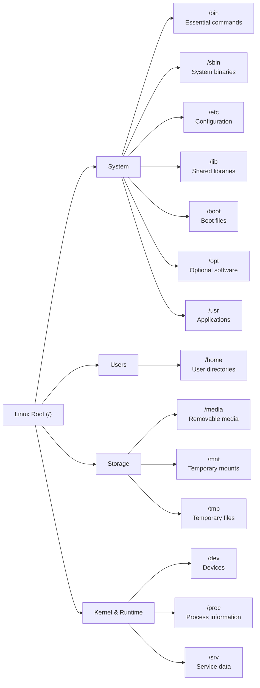

# Linux Toolbox (Week 2)

A quick-reference guide for common Linux concepts and commands.

---

# Day 1 – Filesystem & Navigation

## Linux File Hierarchy



---

## Common Directories

| Directory | Purpose |
|-----------|---------|
| `/` | Root of the Linux filesystem |
| `/bin` | Essential user commands |
| `/boot` | Boot loader files |
| `/dev` | Device files |
| `/etc` | System configuration |
| `/home` | User home directories |
| `/lib` | Shared libraries |
| `/media` | Removable media |
| `/mnt` | Temporary mount points |
| `/opt` | Optional software |
| `/proc` | Process and kernel information |
| `/sbin` | System administration commands |
| `/srv` | Service data |
| `/tmp` | Temporary files |
| `/usr` | User applications and utilities |

---

# Absolute vs Relative Paths

## Absolute Path

**Definition**

Starts at the root directory (`/`) and always points to the same location.

**Example**

```bash
cat /home/user/projects/linux/notes.txt
```

**Use When**

- Shell scripts
- Cron jobs
- System configuration
- Accuracy is critical

---

## Relative Path

**Definition**

Starts from the current working directory.

**Example**

Current directory:

```bash
/home/user
```

Command:

```bash
cd projects/linux
```

Moves to:

```bash
/home/user/projects/linux
```

---

## Special Path Symbols

| Symbol | Meaning |
|--------|---------|
| `.` | Current directory |
| `..` | Parent directory |
| `~` | Current user's home directory |

**Examples**

```bash
./script.sh
```

```bash
cd ../../backup
```

```bash
cd ~
```

```bash
~/platform_practice
```

---

## When to Use

### Absolute Paths

✅ Best for:

- Shell scripts
- Cron jobs
- System services
- Configuration files

### Relative Paths

✅ Best for:

- Interactive terminal use
- Project navigation
- Quick file operations

---

## Common Mistakes

- Forgetting your current working directory
- Using relative paths inside automation scripts
- Mixing Windows (`\`) and Linux (`/`) path separators
- Forgetting that `~` only represents the current user's home directory

---

## Quick Tips

- Use `pwd` to display your current directory.
- Use `~` instead of typing your full home directory.
- Prefer absolute paths in automation.
- Prefer relative paths while navigating projects.

---

# Linux Tips & Shortcuts

## Getting Help

### Manual Pages

Displays the complete documentation for a command.

```bash
man <command>
```

Example:

```bash
man find
```

---

### Quick Help

Displays the available options for a command.

```bash
<command> --help
```

Example:

```bash
find --help
```

---

### TLDR

Provides short, practical examples for common commands.

```bash
tldr <command>
```

Example:

```bash
tldr find
```

Install:

```bash
sudo apt install tldr
```

---

# Wildcards

| Wildcard | Meaning |
|----------|---------|
| `*` | Matches everything |
| `?` | Matches a single character |
| `*.log` | Every `.log` file |
| `*.txt` | Every `.txt` file |

Example:

```bash
mv *.log archive/
```

---

# Brace Expansion

Create multiple directories:

```bash
mkdir -p project/{configs,scripts,logs,data,archive}
```

Create multiple files:

```bash
touch {app,upload,error,debug}.log
```

Numbered files:

```bash
touch server{1..5}.log
```

Works with:

- mkdir
- touch
- cp
- mv
- rm

---

# Directory Shortcuts

| Symbol | Meaning |
|---------|---------|
| `.` | Current directory |
| `..` | Parent directory |
| `~` | Home directory |

Examples:

```bash
cd ..
```

```bash
cd ~
```

```bash
./script.sh
```

---

# Copying Files

Copy a file:

```bash
cp file.txt backup/
```

Copy a directory:

```bash
cp -r project backup/
```

Copy a directory while preserving permissions and timestamps:

```bash
cp -a project backup/
```

Copy only the contents of a directory:

```bash
cp -a source/. destination/
```

---

# Moving Files

Move one file:

```bash
mv file.txt archive/
```

Move multiple files:

```bash
mv *.log archive/
```

Rename a file:

```bash
mv old.txt new.txt
```

---

# Creating Files

Create an empty file:

```bash
touch notes.txt
```

Create multiple files:

```bash
touch {dev,test,prod}.yaml
```

---

# Finding Files

Find every log file:

```bash
find . -name "*.log"
```

Find directories only:

```bash
find . -type d
```

Find files only:

```bash
find . -type f
```

Search from the current directory:

```bash
find .
```

---

# Disk Usage

Show directory sizes:

```bash
du -sh *
```

Largest first:

```bash
du -sh * | sort -hr
```

Smallest first:

```bash
du -sh * | sort -h
```

Check filesystem usage:

```bash
df -h
```

Remember:

- **df** = Disk Free (filesystem usage)
- **du** = Disk Usage (directory/file usage)

---

# Verify Your Work

Common verification commands:

```bash
pwd
```

Current directory.

```bash
ls
```

List files.

```bash
ls -l
```

Detailed listing.

```bash
tree
```

Display directory structure.

---

# Common Mistakes

### `*` expands before the command runs.

Example:

```bash
cp -r * backup/
```

If `backup` is inside the current directory, you'll try to copy `backup` into itself.

---

Use quotes when variables or filenames may contain spaces.

```bash
cp "$file" backup/
```

---

Prefer absolute paths in scripts.

Prefer relative paths while navigating manually.

---

Always verify your results after moving or copying files.

Useful commands:

```bash
tree
ls
pwd
```

---

# My Workflow

When I don't know a command:

1. Try it.
2. Read `--help`.
3. Check `tldr`.
4. Read the `man` page if needed.
5. Add anything useful to this toolbox.