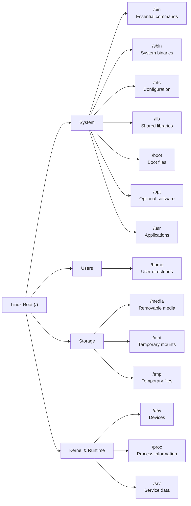

# Linux Toolbox (Week 2)

A quick-reference guide for common Linux concepts and commands.

---

# Linux File Hierarchy



---

## Common Directories

| Directory | Purpose |
|-----------|---------|
| `/` | Root of the Linux filesystem |
| `/bin` | Essential user commands |
| `/boot` | Boot loader files |
| `/dev` | Device files |
| `/etc` | System configuration |
| `/home` | User home directories |
| `/lib` | Shared libraries |
| `/media` | Removable media |
| `/mnt` | Temporary mount points |
| `/opt` | Optional software |
| `/proc` | Process and kernel information |
| `/sbin` | System administration commands |
| `/srv` | Service data |
| `/tmp` | Temporary files |
| `/usr` | User applications and utilities |

---

# Absolute vs Relative Paths

## Absolute Path

**Definition**

Starts at the root directory (`/`) and always points to the same location.

**Example**

```bash
cat /home/user/projects/linux/notes.txt
```

**Use When**

- Shell scripts
- Cron jobs
- System configuration
- Accuracy is critical

---

## Relative Path

**Definition**

Starts from the current working directory.

**Example**

Current directory:

```bash
/home/user
```

Command:

```bash
cd projects/linux
```

Moves to:

```bash
/home/user/projects/linux
```

---

## Special Path Symbols

| Symbol | Meaning |
|--------|---------|
| `.` | Current directory |
| `..` | Parent directory |
| `~` | Current user's home directory |

**Examples**

```bash
./script.sh
```

```bash
cd ../../backup
```

```bash
cd ~
```

```bash
~/platform_practice
```

---

## When to Use

### Absolute Paths

✅ Best for:

- Shell scripts
- Cron jobs
- System services
- Configuration files

### Relative Paths

✅ Best for:

- Interactive terminal use
- Project navigation
- Quick file operations

---

## Common Mistakes

- Forgetting your current working directory
- Using relative paths inside automation scripts
- Mixing Windows (`\`) and Linux (`/`) path separators
- Forgetting that `~` only represents the current user's home directory

---

## Quick Tips

- Use `pwd` to display your current directory.
- Use `~` instead of typing your full home directory.
- Prefer absolute paths in automation.
- Prefer relative paths while navigating projects.